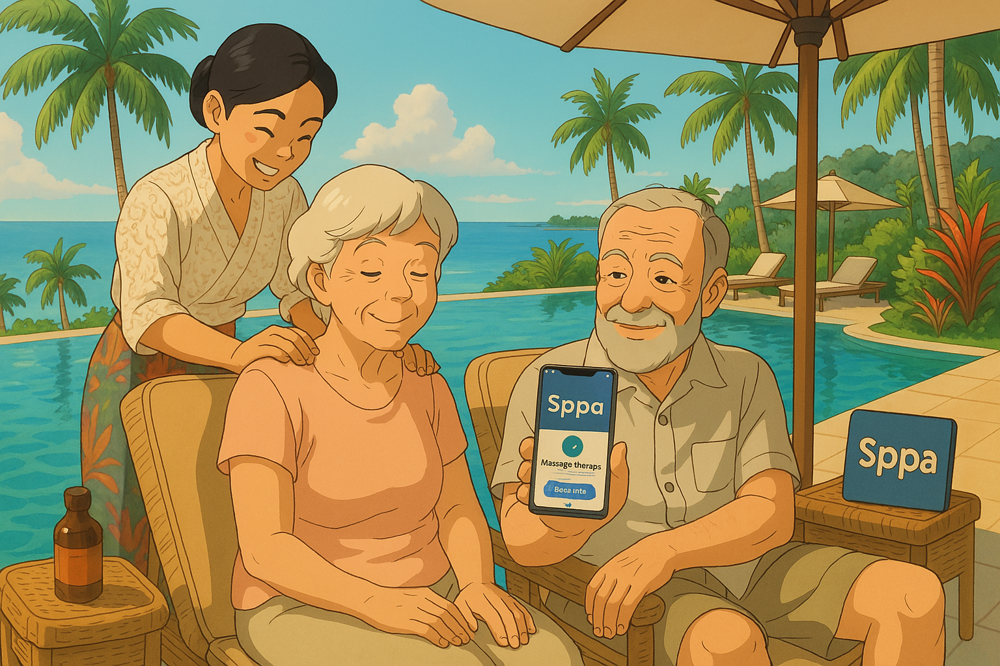
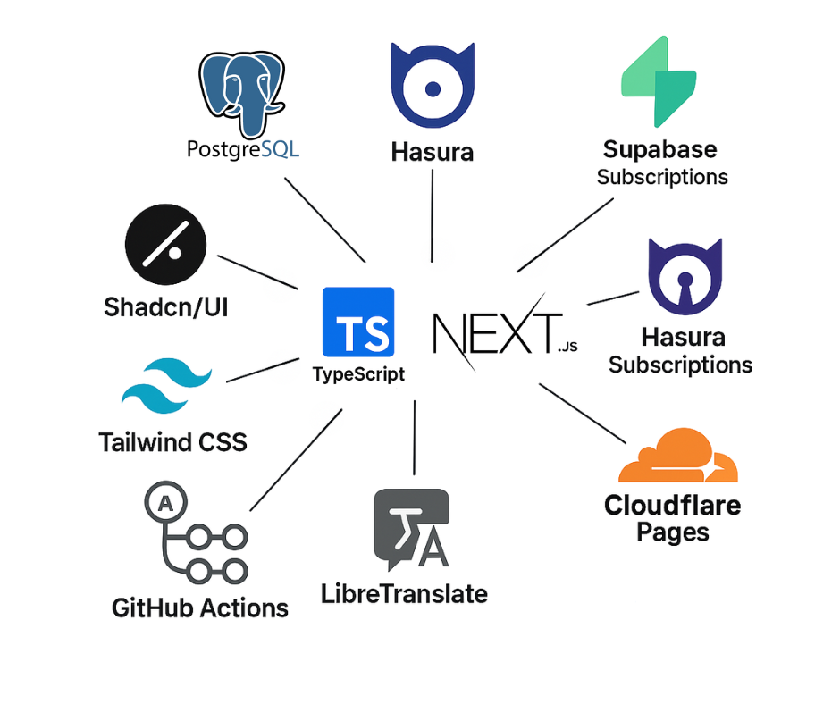

<p align="center">
  
</p>

# Sppa（スッパ）- バリ島のセラピストと観光客を繋ぐコンテンツファーストSNS

**Sppa**は、バリ島の熟練セラピストと、オーストラリア、ドイツ、フランス、韓国、日本、中国など主要国を含む世界中の観光客を、リアルタイムかつ多言語で繋ぐコンテンツファーストSNSプラットフォームです。
言葉の壁や予約の手間を解消し、誰もが心からリラックスできる体験を提供するため、エンジニア同士が自主的に協力しあえるオープンなコミュニティ運営を実現しています。


---


**GitHubリポジトリ編集権限の申請**は[Slack](https://sppaworld.slack.com/archives/C06MP1JQVMK/p1743130927487109)から。


---


## プロジェクトのコンセプト

Sppaは、**リアルタイムチャット、即時予約管理、翻訳機能、SNSフィード**を中核に、セラピストとユーザーの体験を根本から革新します。
私たちは、単なるプロダクト開発に留まらず、参加する全てのメンバーが「創業メンバー」として、自らの力でサービスを共に作り上げることを目指しています。


---


## 自主的なコミュニティでの開発推進

### オープンなコミュニケーション環境

- **GitHub Discussions & Issues**
  - 提案、機能改善、設計の議論はGitHub上で活発に行い、[Issues](https://github.com/TomohiroTani28/Sppa/issues)や[Pull Request](https://github.com/TomohiroTani28/Sppa/pulls)を通じてコードレビューと意見交換を実施します。

- **リアルタイムチャット（Slack）**
  - 日々のコミュニケーションや緊急時のディスカッション、ブレインストーミングには[Slack](https://sppaworld.slack.com/archives/C06MP1JQVMK/p1743130927487109)を活用しています。
  - [Slack](https://sppaworld.slack.com/archives/C06MP1JQVMK/p1743130927487109)から参加し、**#sppa** チャネルで活発に意見交換をしましょう。

- **自動化されたCI/CD**
  - GitHub Actionsによる自動テストとデプロイメントを導入。コードがマージされる前に品質チェックが行われ、安心して開発に集中できます。

### 自主性を尊重した開発環境

- **即時管理権限の付与**
  - 初回コミットの意思表示が確認された開発者には、GitHubリポジトリのディレクトリ編集（Admin相当）の権限を即座に付与。
  - あなたのアイデアや改善提案が、すぐにプロダクトに反映される環境を用意しています。

- **創業メンバーとしての参加**
  - Sppaの成長を共に担う創業メンバーとして、あなたの技術や情熱がサービスの進化に直結します。
  - 将来的なIPO（株式公開）に伴い、貢献度に応じた**最大5%のストックオプション**（または株式）が付与される仕組みを計画中です。最大発行数は45%を想定しています。貢献度が高い方に多くのストックオプションを付与します。定員は設けていませんが、貢献度や重要度が高い順にSppaのコミュニティの承認を経て45%を振り分けます。
  - 書き込み権限を持つコラボレーターの申請やストックオプションについてのご質問は[Slack](https://sppaworld.slack.com/archives/C06MP1JQVMK/p1743130927487109)から。


---


## ストックオプション付与の詳細条件

Sppaは、グローバル市場での急成長とIPOを視野に入れ、貢献したメンバーにリターンを還元します。以下の条件を満たした場合、**最大で5%のストックオプション**を付与する予定です。（最終条件は個別面談・契約により決定します。）

1. **継続的な貢献:**
   - 最低6ヶ月間、定期的なコミットおよび議論参加を行うこと。

2. **主要機能への貢献:**
   - リアルタイムチャット、予約管理、翻訳機能など、サービスの中核部分の設計と実装で主導的役割を果たすこと。

3. **積極的なコミュニケーション:**
   - GitHub上での[Issues](https://github.com/TomohiroTani28/Sppa/issues) 、 [Discussions](https://github.com/TomohiroTani28/Sppa/discussions)、[Pull Request](https://github.com/TomohiroTani28/Sppa/pulls)を通じた建設的な意見交換およびコードレビューに積極的に参加すること。

4. **プロダクトへの提案と実行:**
   - 新機能や改善点の提案を実行に移し、実際にプロトタイプや実装を通してプロダクトの向上に寄与すること.

> これらの条件はあくまでガイドラインです。最終的な付与割合や具体的な契約条件は、個々の貢献内容に応じた面談の上で決定します。


---


<p align="center">
  
</p>

## 技術スタック & 特徴

| 項目                   | 使用技術                          | 特徴・メリット                                                               |
| ---------------------- | --------------------------------- | ---------------------------------------------------------------------------- |
| **フロントエンド**     | Next.js (App Router), TypeScript  | SSR + CSRを組み合わせたハイブリッド構成で高速かつ柔軟なレンダリングを実現         |
| **UIライブラリ**       | Shadcn/UI, Tailwind CSS           | シンプルで美しいUIを迅速に構築。カスタマイズも容易で、ユーザー体験を向上               |
| **API・DB**            | Hasura + PostgreSQL (GraphQL)     | スキーマ駆動設計とリアルタイムSubscriptionにより効率的なデータ管理と同期を実現         |
| **ファイル管理**       | Supabase Storage                  | 大容量ファイルのホスティングとCDN配信により、ユーザーに迅速なコンテンツ提供が可能       |
| **リアルタイム通信**   | Hasura Subscriptions              | 専用WebSocketサーバー不要で、リアルタイム更新をシームレスに実装                     |
| **翻訳サービス**       | LibreTranslate                    | 英語、インドネシア語、ドイツ語、フランス語、韓国語、日本語、中国語など、多言語対応に最適 |
| **ホスティング**       | Cloudflare Pages                  | グローバルCDNを活用し、主要国（オーストラリア、ドイツ、フランス、韓国、日本、中国）からの高速アクセスを実現 |
| **CI/CD & セキュリティ**| GitHub Actions, Cloudflare WAF    | 自動テスト・自動デプロイに加え、堅牢なWAFでセキュリティを強化                       |

---

## 主要画面構成
  - ホームフィード（共通）
  - 検索・発見（共通）
  - 施術詳細（共通）
  - チャット（共通・リアルタイム翻訳付き）
  - 予約管理（セラピスト・観光客別）
  - プロフィール管理（セラピスト・観光客別）

---

## 今後の展望

Sppaは、バリ島に根ざしたサービスから始まり、世界各国のユーザーに愛されるプラットフォームへと成長することを目指します。

- **グローバル展開:**
  - オーストラリア、ドイツ、フランス、韓国、日本、中国など主要国への展開を進め、ユーザーに最適な体験を提供します。

- **多言語対応の強化:**
  - 英語、インドネシア語、ドイツ語、フランス語、韓国語、日本語、中国語を基本とし、その他の言語にも柔軟に対応します。

- **プロダクト進化:**
  - ユーザーからのフィードバックを元に、機能追加や改善を継続的に実施。新たな技術やデザインを取り入れ、常に最先端の体験を提供します。

- **IPOを視野にした成長:**
  - 創業メンバーとしての参加と、将来的なストックオプションによるリターンのシェアで、あなたの貢献がSppaの株価上昇に直結する仕組みを構築します。

---

## お問い合わせ・参加方法

- **参加方法:**
  - まずはGitHub上の[Issues](https://github.com/TomohiroTani28/Sppa/issues) や [Discussions](https://github.com/TomohiroTani28/Sppa/discussions)に積極的に参加し、あなたの意見やアイデアをどんどん共有してください。
  - 初回のコミットが確認された時点で、リポジトリの管理権限（Admin相当）を即座に付与いたします。

- **リアルタイムのコミュニケーション:**
  - 日々のディスカッションや緊急連絡には[Slack](https://sppaworld.slack.com/archives/C06MP1JQVMK/p1743130927487109)を利用しています。
  - [Slack](https://sppaworld.slack.com/archives/C06MP1JQVMK/p1743130927487109)に参加し、**#sppa** チャネルで、メンバー同士の交流を深めましょう。
  - バグ報告や機能提案は[Issues](https://github.com/TomohiroTani28/Sppa/issues)から。
  - 書き込み権限を持つコラボレーターの申請やストックオプションについてのご質問は[Slack](https://join.slack.com/t/sppaworld/shared_invite/zt-32jr6lrgi-kvBFS_3znNlyrB6uaHlEcg)から。


---

## あなたの力で未来を切り拓こう

Sppaは、あなたの技術と情熱によって進化するプラットフォームです。
自主的なコミュニティとして、互いに刺激し合い、協力しながら最高のSNSを創り上げましょう。
**創業メンバーとして参加し、共にSppaを世界標準のサービスへと育て上げる仲間を心からお待ちしています。**

さあ、あなたのアイデアとスキルで、未来のSppaを共に創りましょう！


---


## プロジェクトの起動手順


## 🔧 必要な環境

このプロジェクトを動作させるために、以下のツールが必要です。

- **pnpm**（パッケージマネージャ）
- **Docker & Docker Compose**（コンテナ管理）
- **Node.js**（開発環境）

必要に応じて、以下のコマンドでインストールしてください。

```text
npm install -g pnpm
```

1️⃣ 依存パッケージのインストール
まず、pnpm install を実行して必要なパッケージをインストールします。

```text
pnpm install
```
このコマンドを実行すると、package.json に記載されている依存パッケージが node_modules にインストールされます。

2️⃣ Docker コンテナの起動
次に、Docker コンテナをバックグラウンドで起動します。

```text
docker-compose up -d
```
このコマンドを実行すると、docker-compose.yml に記載されているコンテナが起動し、Hasura や Supabase などのバックエンドが立ち上がります。

📝 補足

-d オプションは、バックグラウンドでコンテナを実行するためのオプションです。

コンテナのステータスを確認する場合は、以下のコマンドを実行してください。

```text
docker ps
```
コンテナのログを確認する場合は、以下のコマンドを使用できます。

```text
docker-compose logs -f
```
3️⃣ 開発サーバーの起動
コンテナが起動したら、開発サーバーを実行します。

```text
pnpm dev
```
このコマンドを実行すると、Next.js の開発サーバーが起動し、http://localhost:3000 でアクセスできるようになります。

🛠 トラブルシューティング（問題が発生した場合）
🔹 docker-compose up -d でエラーが発生する場合
Docker が起動していることを確認してください。

.env ファイルが正しく設定されていることを確認してください。

すでにコンテナが起動している場合、以下のコマンドで再起動できます。

```text
docker-compose restart
```
🔹 .env ファイルが正しく設定されているか確認する
.env ファイルの環境変数が正しく設定されていない場合、サーバーが起動しない可能性があります。

環境変数の設定が正しいかどうかを確認するには、以下のコマンドを実行してください。

```text
cat .env.development
```
もし .env ファイルが不足している場合は、.env.example をコピーして作成してください。

```text
cp .env.example .env.development
```
🛑 開発終了時の停止方法
開発を終了する際は、以下のコマンドでコンテナを停止してください。

```text
docker-compose down
```
このコマンドを実行すると、起動していたコンテナが停止し、すべてのプロセスが終了します。

🎯 まとめ
```text
pnpm install
```
で依存関係をインストール
```text
docker-compose up -d
```
 でバックエンドを起動
```text
pnpm dev
```
で開発サーバーを起動

この手順でプロジェクトが正しく起動します。問題が発生した場合は、トラブルシューティングセクションを参考にしてください。


---


## .env テンプレート

```text
# Client-side variables
NEXT_PUBLIC_SUPABASE_URL=
NEXT_PUBLIC_SUPABASE_ANON_KEY=
NEXT_PUBLIC_HASURA_GRAPHQL_ENDPOINT=
NEXT_PUBLIC_HASURA_GRAPHQL_WS_ENDPOINT=
NEXT_PUBLIC_HASURA_GRAPHQL_ADMIN_SECRET=
NEXT_PUBLIC_APP_URL=
NEXT_PUBLIC_APP_NAME=

# Server-side variables
SUPABASE_URL=
SUPABASE_SERVICE_ROLE_KEY=
HASURA_GRAPHQL_DATABASE_URL=
HASURA_GRAPHQL_ADMIN_SECRET=
HASURA_GRAPHQL_JWT_SECRET_FILE=
HASURA_GRAPHQL_ENABLE_CONSOLE=
HASURA_GRAPHQL_SERVER_PORT=
HASURA_GRAPHQL_SERVER_HOST=
HASURA_GRAPHQL_ENABLED_APIS=
HASURA_GRAPHQL_CORS_DOMAIN=

# NextAuth関連
NEXTAUTH_URL=
NEXTAUTH_SECRET=
GOOGLE_CLIENT_ID=
GOOGLE_CLIENT_SECRET=

# LibreTranslate関連
LT_DEBUG=
LT_PORT=

# Supabase関連
POSTGRES_PASSWORD=
POSTGRES_DB=
```

---

## ディレクトリ構造

<details>
<summary>クリックして展開</summary>

```text
Sppa
├── Dockerfile
├── README.md
├── bug_report.md
├── config
│   └── pg_hba.conf
├── docker-compose.dev.yml
├── docker-compose.prod.yml
├── docs
│   └── Sppa概要.md
├── hasura
│   ├── config.yaml
│   ├── metadata
│   │   ├── actions.graphql
│   │   ├── actions.yaml
│   │   ├── allow_list.yaml
│   │   ├── api_limits.yaml
│   │   ├── backend_configs.yaml
│   │   ├── cron_triggers.yaml
│   │   ├── databases
│   │   │   ├── databases.yaml
│   │   │   └── default
│   │   │       └── tables
│   │   │           ├── public_activity_logs.yaml
│   │   │           ├── public_application_settings.yaml
│   │   │           ├── public_bookings.yaml
│   │   │           ├── public_error_logs.yaml
│   │   │           ├── public_event_media.yaml
│   │   │           ├── public_events.yaml
│   │   │           ├── public_geography_columns.yaml
│   │   │           ├── public_geometry_columns.yaml
│   │   │           ├── public_likes.yaml
│   │   │           ├── public_local_experience_categories.yaml
│   │   │           ├── public_local_experience_media.yaml
│   │   │           ├── public_local_experiences.yaml
│   │   │           ├── public_matches.yaml
│   │   │           ├── public_media.yaml
│   │   │           ├── public_notifications.yaml
│   │   │           ├── public_posts.yaml
│   │   │           ├── public_realtime_messages.yaml
│   │   │           ├── public_regions.yaml
│   │   │           ├── public_reviews.yaml
│   │   │           ├── public_service_categories.yaml
│   │   │           ├── public_service_media.yaml
│   │   │           ├── public_spatial_ref_sys.yaml
│   │   │           ├── public_storage_buckets.yaml
│   │   │           ├── public_storage_objects.yaml
│   │   │           ├── public_therapist_availability.yaml
│   │   │           ├── public_therapist_profiles.yaml
│   │   │           ├── public_therapist_services.yaml
│   │   │           ├── public_tourist_profiles.yaml
│   │   │           ├── public_transactions.yaml
│   │   │           ├── public_unavailable_dates.yaml
│   │   │           ├── public_user_preferences.yaml
│   │   │           ├── public_users.yaml
│   │   │           └── tables.yaml
│   │   ├── graphql_schema_introspection.yaml
│   │   ├── inherited_roles.yaml
│   │   ├── metrics_config.yaml
│   │   ├── network.yaml
│   │   ├── opentelemetry.yaml
│   │   ├── permission.yaml
│   │   ├── query_collections.yaml
│   │   ├── remote_schemas.yaml
│   │   ├── rest_endpoints.yaml
│   │   └── version.yaml
│   ├── migrations
│   │   └── default
│   │       ├── 1742053444159_init
│   │       │   └── up.sql
│   │       ├── 1742054367761_init
│   │       │   └── up.sql
│   │       └── 20250226120000_create_tables.sql
│   └── seeds
│       └── default
│           └── 1741574725086_initial_data.sql
├── jwt-secret.json
├── middleware.ts
├── next-env.d.ts
├── next-i18next.config.js
├── next.config.js
├── package.json
├── postcss.config.js
├── public
│   └── images
│       ├── event1.jpg
│       ├── event2.jpg
│       ├── event3.jpg
│       ├── favicon.ico
│       ├── sppa.png
│       ├── sppa2.png
│       ├── technology_stack.png
│       ├── user1.jpg
│       └── user2.jpg
├── scripts
│   ├── dev
│   │   ├── organize_sppa_dirs.sh
│   │   └── server.js
│   ├── generate
│   │   └── api-template.hbs
│   ├── generate-api-from-permissions.js
│   ├── logs
│   │   ├── migration_log.txt
│   │   └── output.txt
│   └── migrations
│       └── script.sql
├── src
│   ├── app
│   │   ├── (common)
│   │   │   ├── chat
│   │   │   │   ├── ChatClient.tsx
│   │   │   │   ├── [userId]
│   │   │   │   │   └── page.tsx
│   │   │   │   ├── components
│   │   │   │   │   ├── AutoTranslate.tsx
│   │   │   │   │   ├── AutoTranslateToggle.tsx
│   │   │   │   │   ├── ChatWindow.tsx
│   │   │   │   │   ├── EmergencyContact.tsx
│   │   │   │   │   ├── MediaShare.tsx
│   │   │   │   │   ├── MessageBubble.tsx
│   │   │   │   │   ├── MessageInput.tsx
│   │   │   │   │   ├── MessageList.tsx
│   │   │   │   │   ├── OnlineTherapists.tsx
│   │   │   │   │   ├── PriorityMessage.tsx
│   │   │   │   │   ├── RecentConversations.tsx
│   │   │   │   │   ├── SearchBar.tsx
│   │   │   │   │   └── TemplateMessage.tsx
│   │   │   │   └── page.tsx
│   │   │   ├── components
│   │   │   │   ├── LocationService.ts
│   │   │   │   └── TouristLayout.tsx
│   │   │   ├── feed
│   │   │   │   ├── FeedClient.tsx
│   │   │   │   ├── components
│   │   │   │   │   ├── FeedList.tsx
│   │   │   │   │   ├── InstantBookingButton.tsx
│   │   │   │   │   ├── MasonryFeed.tsx
│   │   │   │   │   ├── MultiLanguageSupport.tsx
│   │   │   │   │   ├── OfferCarousel.tsx
│   │   │   │   │   ├── PostCard.tsx
│   │   │   │   │   ├── RealTimeAvailabilityBadge.tsx
│   │   │   │   │   ├── RecommendedExperiences.tsx
│   │   │   │   │   ├── RecommendedTherapists.tsx
│   │   │   │   │   ├── TabSelector.tsx
│   │   │   │   │   ├── TranslationToggle.tsx
│   │   │   │   │   └── WelcomeMessage.tsx
│   │   │   │   └── page.tsx
│   │   │   ├── likes
│   │   │   │   └── components
│   │   │   │       ├── LikeButton.tsx
│   │   │   │       └── MatchList.tsx
│   │   │   ├── notifications
│   │   │   │   ├── NotificationsClient.tsx
│   │   │   │   ├── components
│   │   │   │   │   ├── NotificationList.tsx
│   │   │   │   │   └── components
│   │   │   │   │       └── NotificationListStatic.tsx
│   │   │   │   └── page.tsx
│   │   │   ├── search
│   │   │   │   ├── SearchClient.tsx
│   │   │   │   ├── components
│   │   │   │   │   ├── FilterModal.tsx
│   │   │   │   │   ├── FilterPanel.tsx
│   │   │   │   │   ├── MapView.tsx
│   │   │   │   │   ├── RealTimeAvailabilityIndicator.tsx
│   │   │   │   │   ├── ResultCard.tsx
│   │   │   │   │   ├── SearchBar.tsx
│   │   │   │   │   ├── SearchResults.tsx
│   │   │   │   │   ├── TherapistCard.tsx
│   │   │   │   │   ├── TrendDisplay.tsx
│   │   │   │   │   ├── TrendTags.tsx
│   │   │   │   │   └── TrendingSearches.tsx
│   │   │   │   └── page.tsx
│   │   │   ├── therapists
│   │   │   │   └── [therapistId]
│   │   │   │       ├── MediaGallery.tsx
│   │   │   │       ├── ReviewList.tsx
│   │   │   │       ├── TherapistAvailability.tsx
│   │   │   │       ├── TherapistDetail.tsx
│   │   │   │       └── components
│   │   │   │           ├── BookingButton.tsx
│   │   │   │           ├── FilterPanel.tsx
│   │   │   │           ├── RealTimeStatus.tsx
│   │   │   │           ├── ReviewList.tsx
│   │   │   │           ├── ServiceDetails.tsx
│   │   │   │           ├── TherapistCard.tsx
│   │   │   │           ├── TherapistFilter.tsx
│   │   │   │           ├── TherapistList.tsx
│   │   │   │           ├── TherapistMap.tsx
│   │   │   │           └── TherapistProfile.tsx
│   │   │   └── treatment
│   │   │       └── [id]
│   │   │           └── page.tsx
│   │   ├── ApolloClientWrapper.tsx
│   │   ├── ApolloWrapper.tsx
│   │   ├── ClientLayout.tsx
│   │   ├── _not-found.tsx
│   │   ├── api
│   │   │   ├── activity-logs
│   │   │   │   └── route.ts
│   │   │   ├── auth
│   │   │   │   ├── [...nextauth]
│   │   │   │   │   └── route.ts
│   │   │   │   └── get-jwt
│   │   │   │       └── route.ts
│   │   │   ├── error-logs
│   │   │   │   └── route.ts
│   │   │   ├── events
│   │   │   │   └── route.ts
│   │   │   ├── experiences
│   │   │   │   └── route.ts
│   │   │   ├── graphql
│   │   │   │   └── route.ts
│   │   │   ├── graphql-fallback
│   │   │   │   └── route.ts
│   │   │   ├── notifications
│   │   │   │   └── unread
│   │   │   │       └── route.ts
│   │   │   ├── therapists
│   │   │   │   ├── [therapistId]
│   │   │   │   │   ├── availability
│   │   │   │   │   │   └── route.ts
│   │   │   │   │   └── route.ts
│   │   │   │   └── route.ts
│   │   │   ├── translate
│   │   │   │   └── route.ts
│   │   │   ├── trends
│   │   │   │   └── route.ts
│   │   │   └── users
│   │   │       └── [userId]
│   │   │           └── route.ts
│   │   ├── layout.tsx
│   │   ├── login
│   │   │   ├── layout.tsx
│   │   │   └── page.tsx
│   │   ├── page.tsx
│   │   ├── providers.tsx
│   │   ├── signup
│   │   │   └── page.tsx
│   │   ├── therapist
│   │   │   ├── bookings
│   │   │   │   ├── BookingsClient.tsx
│   │   │   │   ├── components
│   │   │   │   │   ├── BookingCalendar.tsx
│   │   │   │   │   ├── BookingDetailModal.tsx
│   │   │   │   │   ├── BookingList.tsx
│   │   │   │   │   └── TransactionList.tsx
│   │   │   │   └── page.tsx
│   │   │   ├── components
│   │   │   │   ├── Sidebar.tsx
│   │   │   │   ├── TherapistAvailabilityPanel.tsx
│   │   │   │   └── TherapistLayout.tsx
│   │   │   ├── dashboard
│   │   │   │   ├── components
│   │   │   │   │   ├── ActivityLog.tsx
│   │   │   │   │   ├── BookingSummary.tsx
│   │   │   │   │   ├── DashboardSummary.tsx
│   │   │   │   │   └── RevenueChart.tsx
│   │   │   │   └── page.tsx
│   │   │   ├── events
│   │   │   │   ├── EventsPageClient.tsx
│   │   │   │   ├── EventsPageWrapper.tsx
│   │   │   │   ├── components
│   │   │   │   │   ├── EventCard.tsx
│   │   │   │   │   ├── EventForm.tsx
│   │   │   │   │   └── EventList.tsx
│   │   │   │   └── page.tsx
│   │   │   ├── hooks
│   │   │   │   ├── useActivityLogs.ts
│   │   │   │   ├── useBookingData.ts
│   │   │   │   ├── useEventData.ts
│   │   │   │   └── useReviewData.ts
│   │   │   ├── page.tsx
│   │   │   ├── profile
│   │   │   │   ├── ProfileClient.tsx
│   │   │   │   ├── components
│   │   │   │   │   ├── AvailabilitySettings.tsx
│   │   │   │   │   ├── EventForm.tsx
│   │   │   │   │   ├── MediaUploadForm.tsx
│   │   │   │   │   ├── ProfileForm.tsx
│   │   │   │   │   ├── ProfileSettings.tsx
│   │   │   │   │   ├── ServiceForm.tsx
│   │   │   │   │   ├── ServiceManagement.tsx
│   │   │   │   │   └── hooks
│   │   │   │   │       ├── useProfileData.ts
│   │   │   │   │       └── useRealTimeProfileUpdates.ts
│   │   │   │   └── page.tsx
│   │   │   ├── reviews
│   │   │   │   ├── ReviewsClient.tsx
│   │   │   │   ├── components
│   │   │   │   │   ├── ReviewDetailModal.tsx
│   │   │   │   │   ├── ReviewList.tsx
│   │   │   │   │   └── ReviewOverview.tsx
│   │   │   │   └── page.tsx
│   │   │   └── settings
│   │   │       └── page.tsx
│   │   └── tourist
│   │       ├── bookings
│   │       │   ├── BookingsClient.tsx
│   │       │   ├── components
│   │       │   │   ├── AddOption.tsx
│   │       │   │   ├── BookingCalendar.tsx
│   │       │   │   ├── BookingCard.tsx
│   │       │   │   ├── BookingDetailModal.tsx
│   │       │   │   ├── BookingForm.tsx
│   │       │   │   ├── BookingList.tsx
│   │       │   │   ├── CancelPolicy.tsx
│   │       │   │   ├── MyBookingsList.tsx
│   │       │   │   ├── RealTimeAvailability.tsx
│   │       │   │   ├── ReminderNotification.tsx
│   │       │   │   └── TransactionDetails.tsx
│   │       │   └── page.tsx
│   │       ├── local-experiences
│   │       │   ├── ClientWrapper.tsx
│   │       │   ├── LocalExperiencesClient.tsx
│   │       │   ├── [experienceId]
│   │       │   │   ├── components
│   │       │   │   │   └── MediaGallery.tsx
│   │       │   │   └── page.tsx
│   │       │   ├── components
│   │       │   │   ├── ExperienceCard.tsx
│   │       │   │   └── ExperienceList.tsx
│   │       │   └── page.tsx
│   │       ├── preferences
│   │       │   ├── ClientWrapper.tsx
│   │       │   ├── PreferencesClient.tsx
│   │       │   ├── components
│   │       │   │   └── PreferenceForm.tsx
│   │       │   └── page.tsx
│   │       └── profile
│   │           ├── ClientWrapper.tsx
│   │           ├── ProfileClient.tsx
│   │           ├── components
│   │           │   ├── DarkModeToggle.tsx
│   │           │   ├── PaymentMethod.tsx
│   │           │   ├── PreferencesForm.tsx
│   │           │   ├── ProfileEdit.tsx
│   │           │   ├── ProfileForm.tsx
│   │           │   ├── ProfileView.tsx
│   │           │   └── ReviewHistory.tsx
│   │           └── page.tsx
│   ├── backend
│   │   └── api
│   │       ├── generated-api.ts
│   │       └── graphql
│   │           ├── availability.ts
│   │           ├── bookings.ts
│   │           ├── error-logs.ts
│   │           ├── events.ts
│   │           ├── index.ts
│   │           ├── likes.ts
│   │           ├── local-experiences.ts
│   │           ├── media.ts
│   │           ├── reviews.ts
│   │           ├── services.ts
│   │           ├── therapists.ts
│   │           ├── transactions.ts
│   │           ├── trends.ts
│   │           └── users.ts
│   ├── components
│   │   ├── Avatar.tsx
│   │   ├── BookingButton.tsx
│   │   ├── BottomNavigation.tsx
│   │   ├── ChatHeader.tsx
│   │   ├── ClientProviders.tsx
│   │   ├── ErrorBoundary.tsx
│   │   ├── FeedFilters.tsx
│   │   ├── HomeContent.tsx
│   │   ├── HomeHeader.tsx
│   │   ├── LanguageSwitcher.tsx
│   │   ├── LoadingSpinner.tsx
│   │   ├── LoginForm.tsx
│   │   ├── MediaDisplay.tsx
│   │   ├── MediaGallery.tsx
│   │   ├── MultiLanguageSupport.tsx
│   │   ├── NotificationItem.tsx
│   │   ├── OfferCarousel.tsx
│   │   ├── PriceDisplay.tsx
│   │   ├── PushNotification.tsx
│   │   ├── RatingStars.tsx
│   │   ├── RecommendedExperiences.tsx
│   │   ├── ReviewCard.tsx
│   │   ├── ServiceBadge.tsx
│   │   ├── ServiceDetails.tsx
│   │   ├── SessionProviderWrapper.tsx
│   │   ├── TeaserCard.tsx
│   │   ├── TherapistAvailabilityPanel.tsx
│   │   ├── TherapistAvailabilityStatus.tsx
│   │   ├── UserCard.tsx
│   │   ├── auth
│   │   │   ├── LoginForm.tsx
│   │   │   └── SignUpForm.tsx
│   │   └── ui
│   │       ├── Alert.tsx
│   │       ├── Badge.tsx
│   │       ├── Button.tsx
│   │       ├── Calendar.tsx
│   │       ├── Card.tsx
│   │       ├── Checkbox.tsx
│   │       ├── DatePicker.tsx
│   │       ├── Dialog.tsx
│   │       ├── ErrorMessage.tsx
│   │       ├── Form.tsx
│   │       ├── Input.tsx
│   │       ├── Label.tsx
│   │       ├── Navbar.tsx
│   │       ├── Select.tsx
│   │       ├── Spinner.tsx
│   │       ├── Switch.tsx
│   │       ├── Text.tsx
│   │       └── Toast.tsx
│   ├── contexts
│   │   ├── AuthContext.tsx
│   │   ├── ChatContext.tsx
│   │   └── RealtimeContext.tsx
│   ├── graphql
│   │   ├── queries.ts
│   │   └── subscriptions.ts
│   ├── hooks
│   │   ├── api
│   │   │   ├── availability.ts
│   │   │   ├── index.ts
│   │   │   ├── useActivityLogging.ts
│   │   │   ├── useActivityLogs.ts
│   │   │   ├── useAuth.ts
│   │   │   ├── useCreateBooking.ts
│   │   │   ├── useCreateEvent.ts
│   │   │   ├── useCreateReview.ts
│   │   │   ├── useCreateTransaction.ts
│   │   │   ├── useErrorLogApi.ts
│   │   │   ├── useFetchEvents.ts
│   │   │   ├── useFetchFilters.ts
│   │   │   ├── useFetchLocalExperiences.ts
│   │   │   ├── useFetchMedia.ts
│   │   │   ├── useFetchReviews.ts
│   │   │   ├── useFetchSearchResults.ts
│   │   │   ├── useFetchServiceCategories.ts
│   │   │   ├── useFetchServices.ts
│   │   │   ├── useFetchTherapistLocations.ts
│   │   │   ├── useFetchTherapists.ts
│   │   │   ├── useFetchTrends.ts
│   │   │   ├── useFetchUser.ts
│   │   │   ├── useIsomorphicLayoutEffect.ts
│   │   │   ├── useLikeTherapist.ts
│   │   │   ├── useLikeUser.ts
│   │   │   ├── useMatchList.ts
│   │   │   ├── useMedia.ts
│   │   │   ├── useNotification.ts
│   │   │   ├── useNotificationsApi.ts
│   │   │   ├── useRealtimeAvailability.ts
│   │   │   ├── useServices.ts
│   │   │   ├── useTherapistAvailabilityApi.ts
│   │   │   ├── useTherapistData.tsx
│   │   │   ├── useTherapistSearch.ts
│   │   │   ├── useTransactions.ts
│   │   │   ├── useTrends.ts
│   │   │   ├── useUnreadNotifications.ts
│   │   │   ├── useUpdateUser.ts
│   │   │   ├── useUser.ts
│   │   │   └── users.ts
│   │   ├── ui
│   │   │   └── useBottomSheet.ts
│   │   ├── useAutoTranslation.ts
│   │   ├── useBookingNotifications.ts
│   │   ├── useFeedData.ts
│   │   ├── useFeedStore.ts
│   │   ├── useHomeData.ts
│   │   ├── useLocalExperiences.ts
│   │   ├── useLocationService.ts
│   │   ├── useMyBookings.ts
│   │   ├── useNotificationCount.ts
│   │   ├── useNotificationState.ts
│   │   ├── useOnlineUsers.ts
│   │   ├── usePageData.ts
│   │   ├── usePosts.ts
│   │   ├── useRealTimeAvailability.ts
│   │   ├── useRealTimeReviews.ts
│   │   ├── useRealtimeChat.ts
│   │   ├── useRecentChats.ts
│   │   ├── useSearchResults.ts
│   │   ├── useSearchUsers.ts
│   │   ├── useTherapistAvailability.ts
│   │   ├── useTherapistDetails.ts
│   │   ├── useTherapistErrorEffect.ts
│   │   ├── useTherapistSearch.ts
│   │   ├── useUserPreferences.ts
│   │   ├── useUserProfile.ts
│   │   └── useWebSocketSubscription.ts
│   ├── i18n
│   │   ├── I18nProvider.tsx
│   │   ├── client.ts
│   │   ├── i18n.ts
│   │   ├── messages.json
│   │   ├── server.ts
│   │   └── settings.ts
│   ├── lib
│   │   ├── auth.client.ts
│   │   ├── auth.server.ts
│   │   ├── create-ws-client.ts
│   │   ├── currency-utils.ts
│   │   ├── date-utils.ts
│   │   ├── enum-utils.ts
│   │   ├── geoUtils.ts
│   │   ├── hasura-client.ts
│   │   ├── i18n.ts
│   │   ├── queries
│   │   │   ├── media.ts
│   │   │   ├── post.ts
│   │   │   ├── service.ts
│   │   │   ├── therapistAvailability.ts
│   │   │   └── user.ts
│   │   ├── storage-utils.ts
│   │   ├── string-utils.ts
│   │   ├── supabase-client.ts
│   │   ├── token.ts
│   │   └── utils.ts
│   ├── locales
│   │   ├── en.json
│   │   └── id.json
│   ├── realtime
│   │   ├── RealtimeBookingList.tsx
│   │   ├── RealtimeEventList.tsx
│   │   ├── RealtimeMatchList.tsx
│   │   ├── TherapistAvailabilityStatus.tsx
│   │   ├── availability-listener.ts
│   │   ├── bookings-listener.ts
│   │   ├── chat-listener.ts
│   │   ├── index.ts
│   │   ├── likes-listener.ts
│   │   ├── notifications-listener.ts
│   │   ├── notifications-push.tsx
│   │   ├── profile-listener.ts
│   │   ├── useNotifications.ts
│   │   ├── useRealtimeAvailability.ts
│   │   ├── useRealtimeBookings.ts
│   │   ├── useRealtimeChat.ts
│   │   ├── useRealtimeEvents.ts
│   │   ├── useRealtimeFeedUpdates.ts
│   │   ├── useRealtimeMatchList.ts
│   │   ├── useRealtimeReviews.ts
│   │   └── useRealtimeTransactions.ts
│   ├── styles
│   │   ├── globals.css
│   │   └── theme.ts
│   ├── types
│   │   ├── activity-log.ts
│   │   ├── auth.ts
│   │   ├── availability.ts
│   │   ├── booking.ts
│   │   ├── chat.ts
│   │   ├── enums.ts
│   │   ├── error-log.ts
│   │   ├── event.ts
│   │   ├── graphql.ts
│   │   ├── like.ts
│   │   ├── local-experience.ts
│   │   ├── lodash.d.ts
│   │   ├── match.ts
│   │   ├── media.ts
│   │   ├── next-auth.d.ts
│   │   ├── next-i18next.d.ts
│   │   ├── notification.ts
│   │   ├── post.ts
│   │   ├── preference.ts
│   │   ├── react-window.d.ts
│   │   ├── review.ts
│   │   ├── service.ts
│   │   ├── shadcn__ui.d.ts
│   │   ├── supabase.ts
│   │   ├── therapist.ts
│   │   ├── tourist.ts
│   │   ├── transaction.ts
│   │   ├── user.ts
│   │   ├── ws.d.ts
│   │   └── zen-observable-ts.d.ts
│   └── utils
│       ├── auth.ts
│       └── supabase
│           └── server.ts
├── supabase
│   └── config.toml
├── tailwind.config.js
└── tsconfig.json
```
</details>

## Sppaプロジェクト Issueテンプレートの使用方法

GitHubのIssueテンプレートは、プロジェクトのコミュニケーションを効率化し、Issueの管理を容易にするための強力なツールです。Sppaプロジェクトでは、バグ報告、議論、機能提案、質問の4つのテンプレートを用意しています。このガイドでは、これらのテンプレートの使用方法を詳しく説明し、実際のテンプレートの内容をコピーしてすぐに使えるように提供します。


---


## 1. はじめに

Issueテンプレートを使用することで、Issueの作成が簡単になり、開発者やコミュニティメンバーが内容を迅速に理解できるようになります。これにより、問題の解決や議論の進行がスムーズに行われ、プロジェクト全体の効率が向上します。Sppaプロジェクトでは、以下の4つのテンプレートを用意しています：

- **`bug_report.md`**: バグや不具合の報告用
- **`discussion.md`**: 開発やコミュニティに関する議論用
- **`feature_request.md`**: 新機能や改善の提案用
- **`question.md`**: 質問や疑問の解消用


---


## 2. Issueの作成手順

テンプレートを使用してIssueを作成する手順は以下の通りです。

1. **リポジトリの「Issues」タブを開く**  
   [SppaのIssuesページ](https://github.com/TomohiroTani28/Sppa/issues) にアクセスします。
2. **「New Issue」ボタンをクリック**  
   右上に表示される「New Issue」ボタンを押します。
3. **テンプレートを選択**  
   テンプレート選択画面が表示されます。目的に合ったテンプレートを選びます：
   - バグ報告：`bug_report.md`
   - 議論・提案：`discussion.md`
   - 機能提案：`feature_request.md`
   - 質問・相談：`question.md`
4. **テンプレートの入力欄を埋める**  
   選択したテンプレートに用意された項目に、必要な情報を記入します。
5. **Issueを投稿**  
   入力が完了したら「Submit new issue」ボタンをクリックして投稿します。


---


## 3. 各テンプレートの使用方法

### 3.1 バグ報告（bug_report.md）

#### 目的
Sppaの動作に関する問題を報告し、開発者が迅速に修正に取り組めるようにする。

#### 主な入力項目
- **バグの概要**: 問題を簡潔に記述（例: 「チャット画面でメッセージが更新されない」）。
- **再現手順**: バグを再現する具体的な手順を箇条書きで記載。
- **期待される動作**: 本来どうなるべきかを説明。
- **実際の動作**: 実際に起きたことを詳細に記述。
- **環境情報**: 使用デバイス、OS、ブラウザ、Sppaのバージョンなどを記載。
- **スクリーンショットやログ**（任意）: 問題を視覚的に示す画像やエラーログを添付。

#### ヒント
再現手順や環境情報を具体的に書くと、開発者が問題を特定しやすくなります。

### bug_report.md
```
---
name: バグ報告
about: Sppaの動作に関する問題を報告し、改善に協力してください
title: '[バグ] '
labels: bug
assignees: ''
---

## 🐞 バグの概要
<!-- どんな問題が起きているのか、簡潔に説明してください。例: 「リアルタイムチャットでメッセージが表示されない」 -->

## 🔍 再現手順
<!-- バグを再現するための具体的な手順を記載してください。箇条書きで分かりやすく！ -->
1. 
2. 
3. 
4. 

## 🤔 期待される動作
<!-- 本来どうなるべきだったのか説明してください。例: 「送信したメッセージが即座にチャット画面に表示される」 -->

## 😟 実際の動作
<!-- 何が起きたのか詳細に記述してください。例: 「メッセージ送信後、画面に何も表示されず、エラーメッセージも出ない」 -->

## 💻 環境情報
- **使用デバイス**: 
- **OSバージョン**: 
- **ブラウザ**: 
- **Sppaバージョン**: 
- **言語設定**: 

## 📸 スクリーンショットやログ
<!-- 問題を視覚的に示す画像やエラーログがあれば、ドラッグ＆ドロップで添付してください -->

## 💬 追加情報
<!-- 他に役立つ情報があれば自由に記載してください。例: 「特定の時間帯に頻発するようです」 -->

---

**💡 ヒント**: バグ報告は具体的な再現手順が重要です！他の開発者がすぐに問題を理解できるように、できるだけ詳しく書いてください。
```


---


### 3.2 議論・提案（discussion.md）

#### 目的
Sppaの開発やコミュニティに関するオープンな議論を始める。

#### 主な入力項目
- **議論のテーマ**: 話したい内容を簡潔に説明。
- **議論の目的**: 何を達成したいかを記述。
- **現在の状況**: 関連する背景や現状を記載。
- **あなたの意見**（任意）: 自分の考えや提案を記述。
- **コミュニティへの質問**（任意）: 他のメンバーに聞きたいことを記載。

#### ヒント
オープンな議論を通じて多様な意見を集め、Sppaをより良くできます。

#### discussion.md
```
---
name: 議論・提案
about: Sppaの開発やコミュニティに関するオープンな議論を始めましょう
title: '[議論・提案] '
labels: discussion
assignees: ''
---

## 🗣️ 議論のテーマ
<!-- 何について話したいのか簡潔に説明してください。例: 「多言語対応の優先順位について」 -->

## 🎯 議論の目的
<!-- この議論で何を達成したいのか説明してください。例: 「どの言語を最初に追加すべきかコミュニティで意見をまとめたい」 -->

## 📊 現在の状況
<!-- 関連する現状や背景を記載してください。例: 「現在は英語とインドネシア語のみ対応。次は日本語と韓国語が候補に挙がっている」 -->

## 💭 あなたの意見
<!-- あなた自身の考えや提案を記載してください（任意）。例: 「日本からの観光客が多いので、日本語を優先すべきと思う」 -->

## ❓ コミュニティへの質問
<!-- 他のメンバーに聞いてみたいことがあれば記載してください。例: 「皆さんが対応してほしい言語は何ですか？理由も教えてください」 -->

## 💬 追加情報
<!-- 他に役立つ情報があれば自由に記載してください。例: 「Slackでも並行して意見を募集しています」 -->

---

**💡 ヒント**: 議論はオープンな場です！多様な意見がSppaをより良いものにします。Slackの#sppaチャネルでも気軽に話しかけてください。
```


---


### 3.3 機能提案（feature_request.md）

#### 目的
Sppaに新しい機能や改善を提案し、プロジェクトの進化に貢献する。

#### 主な入力項目
- **提案する機能**: 追加したい機能を簡潔に説明。
- **この機能が必要な理由**: なぜ必要かを説明。
- **想定される実装方法**（任意）: どのように実装できそうかを提案。
- **ユーザーにとってのメリット**: ユーザー（観光客やセラピスト）にどう役立つかを記述。
- **関連する既存機能**（任意）: 既存機能との関連性を説明。

#### ヒント
提案が具体的でユーザー視点を含んでいると、コミュニティでの議論が活発になります。

### feature_request.md
```
---
name: 機能提案
about: Sppaをより良くするためのアイデアを提案してください
title: '[提案] '
labels: enhancement
assignees: ''
---

## 💡 提案する機能
<!-- どんな機能を追加したいか簡潔に説明してください。例: 「セラピストの評価システムを追加」 -->

## 🤔 この機能が必要な理由
<!-- なぜこの機能がSppaに必要なのか説明してください。例: 「観光客がセラピストを選ぶ際に信頼性を判断しやすくなるため」 -->

## 🛠️ 想定される実装方法
<!-- どのように実装できそうかアイデアがあれば記載してください（任意）。例: 「5つ星評価とコメント欄をセラピストプロフィールに追加し、Hasuraでデータ管理」 -->

## 🌟 ユーザーにとってのメリット
<!-- この機能がユーザー（観光客やセラピスト）にどう役立つか説明してください。例: 「観光客は質の高いセラピストを選びやすくなり、セラピストは良い評価を得るモチベーションになる」 -->

## 🔗 関連する既存機能
<!-- 既存の機能との関連性があれば記載してください（任意）。例: 「予約管理システムと連携可能」 -->

## 💬 追加情報
<!-- 他に伝えたいことがあれば自由に記載してください。例: 「類似サービスで成功している例を参考にできます」 -->
---

**💡 ヒント**: 機能提案は、コミュニティ全体で議論を深める絶好の機会です！あなたのアイデアがSppaを次のレベルに引き上げるかもしれません。
```


---


### 3.4 質問・相談（question.md）

#### 目的
Sppaに関する疑問を解消し、理解を深める。

#### 主な入力項目
- **質問内容**: 何を聞きたいかを簡潔に説明。
- **質問の背景**: なぜこの質問をするのか状況を記述。
- **試したこと**（任意）: 自分で調べたり試したりした内容を記載。
- **期待する回答**（任意）: どんな情報が欲しいかを具体的に書く。

#### ヒント
気軽に質問してください。コミュニティメンバーが丁寧に答えてくれるでしょう。

### question.md
```
---
name: 質問・相談
about: Sppaに関する疑問を解消するための質問をしてください
title: '[質問・相談] '
labels: question
assignees: ''
---

## ❓ 質問内容
<!-- 何を聞きたいのか簡潔に説明してください。例: 「リアルタイム翻訳機能はオフラインでも使えますか？」 -->

## 🧐 質問の背景
<!-- なぜこの質問をするのか、状況を説明してください。例: 「旅行中にネット接続が不安定な場所で使う可能性があるため」 -->

## 🔍 試したこと
<!-- 自分で調べたり試したりしたことがあれば記載してください（任意）。例: 「ドキュメントを読んだがオフライン対応についての記載が見つからなかった」 -->

## 🤔 期待する回答
<!-- どんな情報が欲しいのか具体的に書いてください（任意）。例: 「オフラインでの動作可否と、対応していない場合の代替案を知りたい」 -->

## 💬 追加情報
<!-- 他に伝えたいことがあれば自由に記載してください。例: 「急ぎではないので、時間があれば回答お願いします」 -->

---

**💡 ヒント**: 質問は遠慮せずに！コミュニティメンバーが親切に答えてくれるはずです。Slackでも気軽に聞いてみてください。
```

### 4. リンク

[SppaのIssuesページ](https://github.com/TomohiroTani28/Sppa/issues): Issueの作成や確認はこちらから。  
[SppaのDiscussionsページ](https://github.com/TomohiroTani28/Sppa/discussions): よりオープンな議論をしたい場合は、Discussionsを活用してください。

### 5. まとめ  
SppaプロジェクトのIssueテンプレートは、コミュニティ参加を促進し、プロジェクトを効率的に進めるための重要なツールです。テンプレートに沿ってIssueを作成することで、誰でも簡単に貢献できます。あなたの報告やアイデアが、Sppaをさらに素晴らしいプロジェクトにする一歩となるでしょう。ぜひ積極的に活用し、コミュニティの一員として参加してください！
